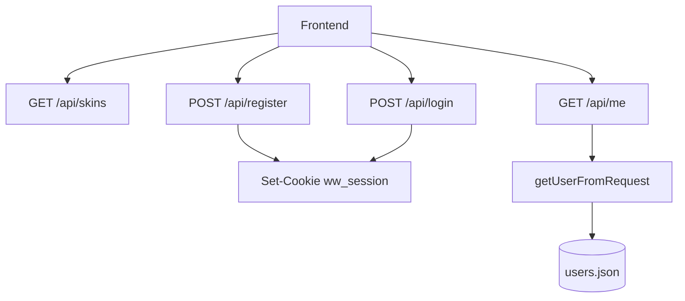

# L_Shop — документация к лабе

Ниже только то, что просили в задании.

---

## 1) Бэк: визуальная документация API

База URL: `http://localhost:3000`

| Метод | URL | Что делает | Нужна авторизация |
|---|---|---|---|
| GET | `/api/skins` | Отдает все скины | Нет |
| POST | `/api/register` | Регистрирует пользователя | Нет |
| POST | `/api/login` | Логин пользователя | Нет |
| GET | `/api/me` | Возвращает текущего пользователя | Да (cookie) |
| GET | `/api/protected` | Пример защищенного роута | Да (cookie) |

### Схема как ходят запросы



### Коротко по телам запросов

- `POST /api/register`
```json
{ "login": "string", "password": "string" }
```

- `POST /api/login`
```json
{ "login": "string", "password": "string" }
```

---

## 2) Бэк: утилитарные функции в формате JSDoc + типы

Примеры JSDoc для текущих утилит из `src/server.ts`:

```ts
/**
 * Читает JSON из файла.
 * Если файл не найден/пустой/битый, возвращает defaultValue.
 * @template T
 * @param {string} filePath
 * @param {T} defaultValue
 * @returns {T}
 */
function readJsonFile<T>(filePath: string, defaultValue: T): T
```

```ts
/**
 * Записывает данные в JSON-файл.
 * @template T
 * @param {string} filePath
 * @param {T} data
 * @returns {void}
 */
function writeJsonFile<T>(filePath: string, data: T): void
```

```ts
/**
 * Создает новую сессию.
 * @param {string} userId
 * @returns {string}
 */
function createSession(userId: string): string
```

```ts
/**
 * Пытается получить пользователя из cookie.
 * @param {Request} req
 * @returns {IUserRecord | null}
 */
function getUserFromRequest(req: Request): IUserRecord | null
```

---

## 3) Типизация в доке

Типы, которые используются в проекте:

```ts
export interface ISkin {
  id: string;
  name: string;
  price: number;
  rarity: 'Common' | 'Rare' | 'Legendary' | 'Ancient';
  wear: string;
  image: string;
  category: string;
}

export interface IUser {
  id: string;
  login: string;
  balance: number;
  inventory: ISkin[];
}
```

```ts
interface IUserRecord extends IUser {
  password: string;
}

interface IDatabase {
  users: IUserRecord[];
}
```

---

## 4) Фронт: стандартизация компонентов

Чтобы не было «10 разных кнопок», используем единые классы:

- кнопки в хедере: `navbar__button`
- основная кнопка: `navbar__button--primary`
- кнопка в карточке: `skin-card__button`
- вариант продажи: `skin-card__button--sell`
- карточка скина: структура `skin-card__*`
- модалка авторизации: `auth-modal__*`

Идея простая: переиспользуем существующие компоненты и модификаторы, а не делаем новые с нуля под каждый цвет.

---

## 5) Фронт: JSDoc для независимых/утилитарных функций

Примеры для `public/main.ts`:

```ts
/**
 * Форматирует цену.
 * @param {number} price
 * @returns {string}
 */
function formatPrice(price: number): string
```

```ts
/**
 * Универсальный запрос к API.
 * @template TResponse
 * @param {RequestInfo} input
 * @param {RequestInit} [init]
 * @returns {Promise<TResponse>}
 */
async function apiFetch<TResponse>(input: RequestInfo, init?: RequestInit): Promise<TResponse>
```

